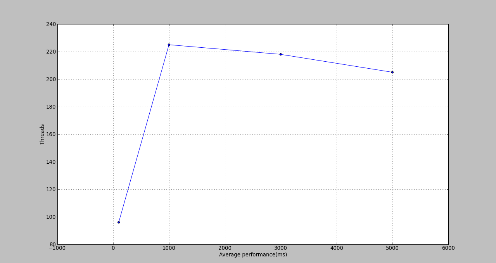

# Project 2.b:  Load/Stress Testing

Managed on Github: [Jmeter Load Test](https://github.com/Lhfcws/Jmeter_Load_Test)

## Task 1: Preparation
> Skip

***

## Task 2: Basic tests to the website

#### basic tests summary for www.google.com
> Condition: Thread Group with 100 threads, Loop Count of 2, and a Ramp-Up period of 5 seconds

refer to: 

+ `Google Thread Group.jmx`
+ `google1.jtl`

***
<table>
<tr><td>Successful cases: </td>  <td> 140</td></tr>
<tr><td>Failure cases: </td>  <td> 40</td></tr>
<tr><td>Average performance (ms): </td> <td> 93466</td></tr>
<tr><td>Average performance(success) (ms): </td>  <td> 23975</td></tr>
<tr><td>Average bytes: </td>  <td> 11543</td></tr>
<tr><td>Average bytes(success): </td>  <td> 13785</td></tr>
<tr><td>Average latency (ms): </td>  <td> 1996</td></tr>
<tr><td>Average latency(success) (ms): </td>  <td> 1725</td></tr>
</table>

***

## Task 3: Performance with different loads

> Condition: a Thread Group with N threads and a Ramp-Up period of 5 seconds to a new Test Plan (Use Loop Count 1)

> N = 100, 1000, 3000, 5000

refer to: 

+ `QQ Test Plan 100.jmx`
+ `QQ Test Plan 1000.jmx`
+ `QQ Test Plan 3000.jmx`
+ `QQ Test Plan 5000.jmx`
+ `QQ Thread Group 100.jtl`
+ `QQ Thread Group 1000.jtl`
+ `QQ Thread Group 3000.jtl`
+ `QQ Thread Group 500.jtl`

***

## Task 4: Create "deep" test plan with JMeter proxy
> Condition: a Thread Group with 5 threads, Loop Count of 2, and a Ramp-Up period of 5 seconds

> Test target: [t.qq.com](http://t.qq.com)

> Test scenarios: 

> 1. Login -> Logout

> 2. Login -> Send weibo

refer to:

+ `Deep Test Plan.jmx`
+ `login_logout.jtl`
+ `login_weibo.jtl`

***
#### User scenario: Login -> Logout

<table>
<tr><td>Average performance (ms)</td><td>1711</td></tr>
<tr><td>Average latency (ms)</td><td>1463</td></tr>
<tr><td>Average bytes</td><td>32446</td></tr>
</table>

***

#### User scenario: Login -> Send weibo

<table>
<tr><td>Average performance (ms)</td><td>872</td></tr>
<tr><td>Average latency (ms)</td><td>845</td></tr>
<tr><td>Average bytes</td><td>11250</td></tr>
</table>
